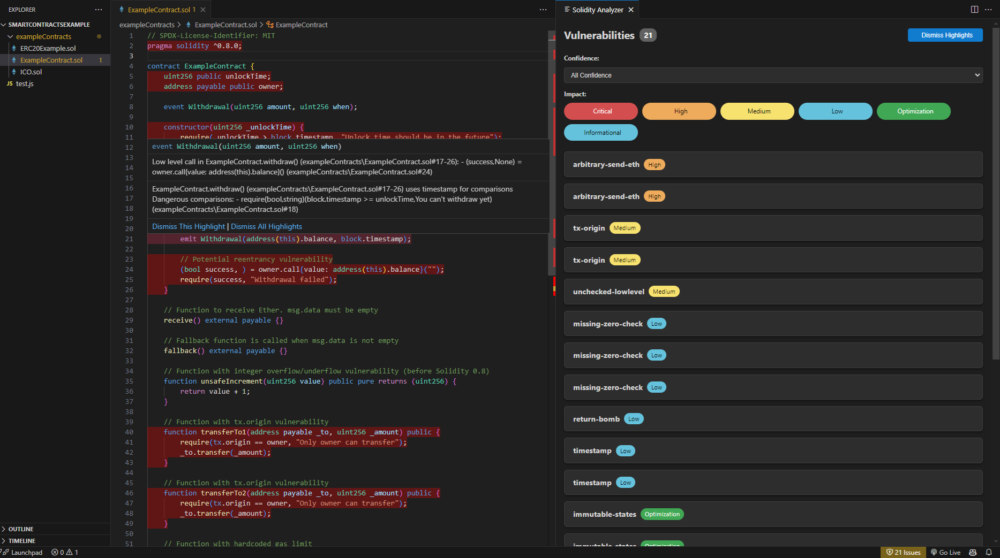

# Solidity Analyzer README

Welcome to the Solidity Analyzer extension for Visual Studio Code. This extension helps you analyze Solidity code for vulnerabilities using the open-source tool Solidity Analyzer.

## Features

- **Security Analysis**: Detect potential vulnerabilities and security issues in Solidity code
- **Code Linting**: Identify style issues, best practices, and gas optimization opportunities
- **Detailed Reports**: View comprehensive analysis with categorized and prioritized issues
- **In-Editor Highlighting**: See issues directly in your code with severity-colored highlights
- **Code Navigation**: Jump directly to problem areas in your codebase
- **Configurable Filters**: Filter results by severity, confidence level, or category
- **Status Bar Integration**: Monitor analysis status and quickly access results

## Requirements

- Visual Studio Code version 1.96.0 or higher.

## Installation

You can install this extension through the VS Code marketplace:
1. Open VS Code
2. Go to Extensions (Ctrl+Shift+X)
3. Search for "Solidity Analyzer"
4. Click Install

## Usage

1. Open a Solidity file or workspace containing Solidity files
2. Use the command palette (Ctrl+Shift+P) and search for "Solidity Analyzer"
3. Select the desired analysis option
4. View results in the editor and detailed panel

You can also:
- Click the shield icon in the status bar to analyze the current file
- Configure auto-analysis on save in the extension settings

## Debugging and Logs

If you encounter any issues with the extension, you can access the logs via the Output Panel:

- Go to View → Output (or press Ctrl+Shift+U)
- Select "Solidity Analyzer" from the dropdown menu at the top of the Output panel

The log level can be configured in the extension settings (`solidityAnalyzer.logLevel`).

## Extension Settings

This extension contributes the following settings:

- `solidityAnalyzer.analyzeNodeModules`: Enable/disable analysis of Solidity files in the `node_modules` folder.
- `solidityAnalyzer.logLevel`: Set the logging level for the extension (`debug`, `info`, `warn`, `error`).
- `solidityAnalyzer.autoAnalyzeOnSave`: Automatically run analysis when saving Solidity files.
- `solidityAnalyzer.filterSeverity`: Show vulnerabilities with selected severity levels (Critical, High, Medium, Low, Informational, Optimization).
- `solidityAnalyzer.highlightColors`: Custom highlight colors for different vulnerability severities.
- `solidityAnalyzer.hideStatusBar`: Hide the Solidity Analyzer status bar item.

## Known Issues

Please report any issues you encounter, or any feedback you might have, by email at iard.solutions@gmail.com

## Release Notes

### 0.2.0

- **Linting Support**: Added integrated Solidity linter to identify coding standards issues and style violations
- **Enhanced UI**:
  - Redesigned interface with improved organization of issues by severity and category
  - Added color-coded category indicators for better visual classification
  - Improved focus button with visual feedback
- **Bug Fixes**:
  - Fixed vulnerability highlighting to use the most specific line range
  - Improved multi-line highlighting to display as a cohesive block
  - Fixed issue with multiple panels opening on repeated analyses
  - Enhanced file resolution logic for better navigation to issues
- **Status Bar Improvements**:
  - Added detailed tooltips showing breakdown of issues by severity and category
  - Click to re-analyze current file
  - Shows combined count of vulnerabilities and linter issues
- **Performance**: Optimized rendering of large result sets

### 0.1.4

- Updated Logging capabilities

### 0.1.3

- Added better highlight handling
- Enhanced interface webview

### 0.1.2

- Added "Dismiss highlights" functionality
- Implemented logging
- Added status bar integration

### 0.1.1

- Added extension logo

### 0.1.0

- Bug fixes and stability improvements

### 0.0.1

- Initial release of Solidity Analyzer.

